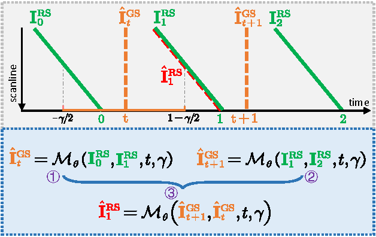

# Self-Supervised Learning for Rolling Shutter Temporal Super-Resolution

This repository contains the source code for the paper: [Self-Supervised Learning for Rolling Shutter Temporal Super-Resolution (IEEE TCSVT 2024)](https://ieeexplore.ieee.org/abstract/document/10681568).
Most cameras on portable devices adopt a rolling shutter (RS) mechanism, encoding sufficient temporal dynamic information through sequential readouts. This advantage can be exploited to recover a temporal sequence of latent global shutter (GS) images. Existing methods rely on fully supervised learning, necessitating specialized optical devices to collect paired RS-GS images as ground-truth, which is too costly to scale. In this paper, we propose **a self-supervised learning framework for the first time to produce a high frame rate GS video from two consecutive RS images**, unleashing the potential of RS cameras. Specifically, we first develop the unified warping model of RS2GS and GS2RS, enabling the complement conversions of RS2GS and GS2RS to be incorporated into a uniform network model. Then, based on the cycle consistency constraint, given a triplet of consecutive RS frames, we minimize the discrepancy between the input middle RS frame and its cycle reconstruction, generated by interpolating back from the predicted two intermediate GS frames. Experiments on various benchmarks show that our approach achieves comparable or better performance than state-of-the-art supervised methods while enjoying stronger generalization capabilities. Moreover, our approach makes it possible to recover smooth and distortion-free videos from two adjacent RS frames in the real-world BS-RSC dataset, surpassing prior limitations.



## Installation
The code is tested with PyTorch 1.9.1 with CUDA 11.4.

Install the dependent packages:
```
pip install -r requirements.txt
```

In our implementation, we borrowed the code framework of [DeepUnrollNet](https://github.com/ethliup/DeepUnrollNet):

#### Install core package
```
cd ./package_core
python setup.py install
```

Furthermore, we adopted the pre-trained optical flow estimation method [GMFlow](https://github.com/haofeixu/gmflow). The version using [RAFT](https://github.com/princeton-vl/RAFT) can be adapted similarly. Meanwhile, the GS-based video frame interpolation method [SoftSplat](https://github.com/JHLew/SoftSplat-Full) is employed as well. 

## Demo with our pretrained model
Please **download the pre-trained models** through [Baidu Netdisk](https://pan.baidu.com/s/19O6FliumWoysiqo0XvCDqg) (link: https://pan.baidu.com/s/19O6FliumWoysiqo0XvCDqg
Extraction code: 1234) and put them in the `deep_unroll_weights` folder.

One can test our self-supervised mothod with the provided rolling shutter images in the `demo_video` folder.

To generate a global shutter video (11 video frames) from two consecutive rolling shutter images, simply run
```
sh demo_video.sh
```
The visualization results will be stored in the `experiments` folder. 

## Datasets
- **Carla-RS** and **Fastec-RS:** Download these two datasets to your local computer from [here](https://github.com/ethliup/DeepUnrollNet).
- **BS-RSC:** Download this real-world dataset to your local computer from [here](https://github.com/ljzycmd/BSRSC).
- **GevRSReal:** Download this real RS-event dataset to your local computer from [here](https://github.com/zxyemo/EvUnroll).

## Training and evaluating
You can run following commands to re-train the network. It is fine-tuning based on the pre-trained model in the `Pretrained` folder.
```
# !! Please update the corresponding paths in 'train_carla.sh', 'train_fastec.sh' and 'train_bsrsc.sh'  #
# !! with your own local paths, before run following command!!      #

sh train_carla.sh
sh train_fastec.sh
sh train_bsrsc.sh
```

You can run following commands to obtain the quantitative evaluations.
```
# !! Please update the path to test data in 'inference.sh'
# !! with your own local path, before run following command!!

sh inference.sh
```

## Citations
If you find our SelfRSSplat useful in your research or applications, please consider giving us a star 🌟 and citing it by the following BibTeX entry.
```
@article{fan2024self,
	title={Self-supervised learning for rolling shutter temporal super-resolution},
	author={Fan, Bin and Guo, Ying and Dai, Yuchao and Xu, Chao and Shi, Boxin},
	journal={IEEE Transactions on Circuits and Systems for Video Technology},
	year={2024},
	publisher={IEEE}
}
```

## Statement
This project is for research purpose only, please contact us for the licence of commercial use. For any other questions or discussion please contact: binfan@mail.nwpu.edu.cn
